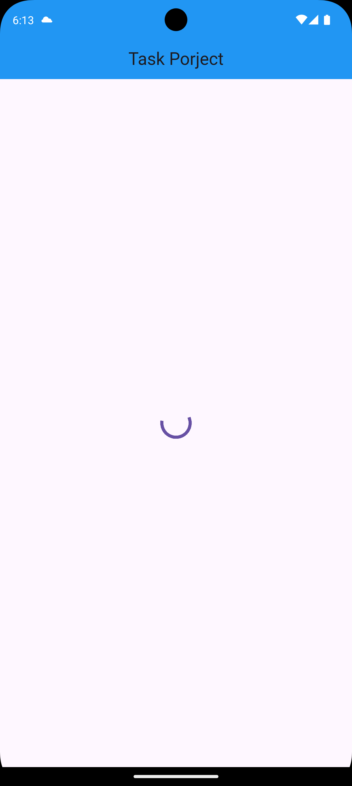

# 🛒 Flutter  Task

A Flutter app that displays a list of products using the [Fake Store API](https://fakestoreapi.com/products).

## 🔧 Tech Used

- Flutter
- Dio
- BLoC/Cubit
- Repository Pattern
- get_it (Dependency Injection)
- MVVM Architecture

## 📸 Screenshots

| Home Screen |
|-------------|
|  |
| Home Screen |
|-------------|
|  |
| Home Screen |
|-------------|
|  |
| Home Screen |
|-------------|
|  |

